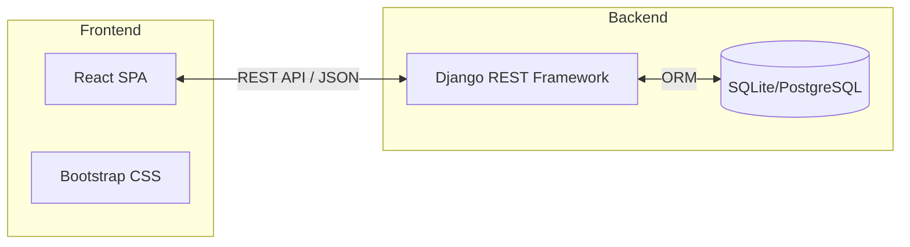
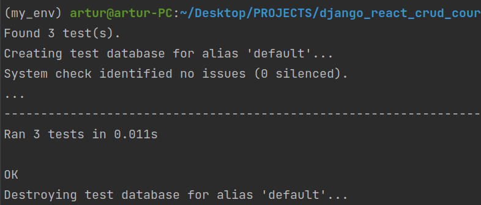
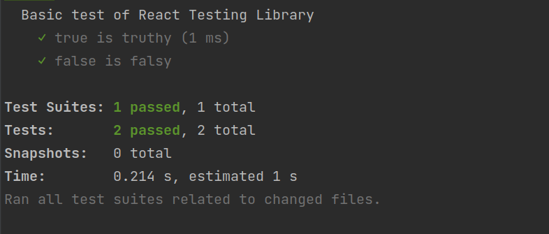
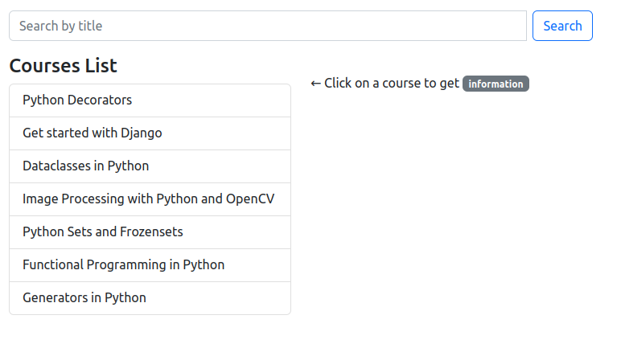
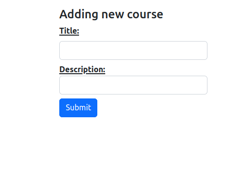

# 🎓 Django Courses Management System

A full-stack web application for managing educational courses, built with **Django REST Framework** (Backend) and **React** (Frontend).

[](https://opensource.org/licenses/MIT)
[](https://www.djangoproject.com/)
[](https://reactjs.org/)

---

## 📑 Table of Contents

- [🚀 Features](#-features)
- [🏗️ Architecture](#️-architecture)
- [🛠️ Tech Stack](#️-tech-stack)
- [💻 Getting Started](#-getting-started)
  - [Prerequisites](#prerequisites)
  - [Option 1: Manual Setup](#option-1-manual-setup)
  - [Option 2: Docker Setup (Recommended)](#option-2-docker-setup-recommended)
- [📂 Project Structure](#-project-structure)
- [🧪 Testing](#-testing)
- [💡 Usage Guide](#-usage-guide)
- [📊 Database Schema](#-database-schema)
- [🤝 Contributing](#-contributing)
- [📝 License](#-license)

---

## 🚀 Features

- **Course Management**: Create, Read, Update, and Delete (CRUD) courses.
- **Search Functionality**: Quickly find courses by title.
- **Published Status**: Filter and view courses based on their publication status.
- **Responsive UI**: Built with React and Bootstrap for a seamless experience across devices.
- **RESTful API**: Clean API design using Django REST Framework.
- **Dockerized**: Easy deployment and development environment setup using Docker Compose.

---

## 🏗️ Architecture

The project follows a decoupled client-server architecture:


```mermaid
graph LR
    subgraph Frontend
        React[React SPA]
        Bootstrap[Bootstrap CSS]
    end

    subgraph Backend
        DRF[Django REST Framework]
        SQLite[(SQLite/PostgreSQL)]
    end

    React <-->|REST API / JSON| DRF
    DRF <-->|ORM| SQLite
```

---

## 🛠️ Tech Stack

**Backend:**
- Python 3.x
- Django 4.2+
- Django REST Framework
- SQLite (Development) / PostgreSQL (Docker)

**Frontend:**
- React
- React Router 6
- Axios (HTTP Client)
- Bootstrap 4

**DevOps:**
- Docker & Docker Compose

---

## 💻 Getting Started

### Prerequisites
- Python 3.10+
- Node.js & npm
- Docker (optional)

### Clone the repository
```bash
git clone git@github.com:zacniewski/django-courses.git
cd django-courses/
```

### Option 1: Manual Setup

#### 1. Backend Setup
```bash
cd backend
python3 -m venv venv
source venv/bin/activate  # On Windows: venv\Scripts\activate
pip install -r requirements.txt
python manage.py migrate
python manage.py runserver
```

#### 2. Frontend Setup
```bash
cd frontend
npm install
npm start
```
The application will be available at `http://localhost:3000` (or `http://localhost:8081` depending on configuration).

---

### Option 2: Docker Setup (Recommended)

Run the entire stack with a single command:
```bash
docker-compose up --build
```

- **Frontend**: `http://localhost:3000`
- **Backend API**: `http://localhost:8000`
- **Database**: PostgreSQL on port `5432`

---

## 📂 Project Structure

### Backend
```text
backend/
├── backend/            # Project configuration
├── courses/            # Course application logic
│   ├── migrations/     # Database migrations
│   ├── fixtures/       # Sample data (course.json)
│   ├── models.py       # Data models
│   ├── serializers.py  # API serializers
│   ├── views.py        # API views
│   └── urls.py         # API routing
└── manage.py
```

### Frontend
```text
frontend/
├── src/
│   ├── components/     # React components
│   ├── services/       # API communication logic
│   ├── utils/          # Helpers (Axios config)
│   └── App.js          # Main application component
└── public/             # Static assets
```

---

## 📊 Database Schema

The `Course` model consists of the following fields:

| Field | Type | Description |
| :--- | :--- | :--- |
| `id` | BigAutoField | Primary Key |
| `title` | CharField | Title of the course |
| `description` | CharField | Brief summary |
| `published` | BooleanField | Publication status |
| `added` | DateField | Auto-generated creation date |

---

## 🧪 Testing

### Backend Tests
Run Django unit tests:
```bash
cd backend
python manage.py test
```


### Frontend Tests
Run Jest tests:
```bash
cd frontend
npm test
```


---

## 💡 Usage Guide

### Browsing Courses
The main dashboard displays all available courses. Use the search bar to filter by title.


### Adding a Course
Navigate to **"Add course"** to create a new entry.


### Loading Sample Data
To populate the database with initial data:
```bash
cd backend
python manage.py loaddata courses/fixtures/course.json
```

---

## 🤝 Contributing

Contributions are welcome! Please see [CONTRIBUTING.md](CONTRIBUTING.md) for details on our development workflow and code style guidelines.

---

## 📝 License

This project is licensed under the MIT License.
