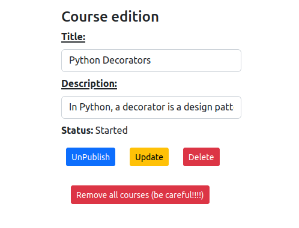

**Django Courses by Artur**

1. Clone the repository. 
    ```bash
    git clone git@github.com:zacniewski/django-courses.git
    cd django-courses/
    ```  

2. Running the project (without using Docker)  
  - the `backend` part (run in the first console):  

    ```bash
    cd backend
    python3 -m venv my_env
    source my_env/bin/activate
    pip install -r requirements.txt
    python manage.py runserver
    ```
  - the `frontend part` part (run in the second console):  

    ```bash
    cd frontend
    npm install
    npm start
    ```
  - the browser should open with the url http://localhost:8081/courses with the following view:  
  

2a. Running the project (with Docker)  
   ```bash
    docker build
    docker-compose up -d
   ```
- click the frontend link shown in the Docker's logs in the console  
- to stop the containers use:  
    ```bash
    docker-compose down
   ```

3. Browsing and editing courses
- navigation looks as follows:  
  
- after clicking one of the courses we can get detailed information about it:  

- we can edit some parameters of the course after clicking `Edit course` button:  
  

4. Adding new courses
- after clicking `Add course` link in the top left part of the page, we can add new course:    

- after submitting the form with success, we can see the following information:    

- the course is now visible on the list at the end of list:    


5. About section
- after clicking `About` link in the navigation menu, we can see some information about the project:  


6. Searching through the courses
- you can look for a given phrase in the titles of courses: 

- after clicking `Search` button, as a result you'll get the list of courses with given phrase:  


7. Fixtures
- if you'd like to manipulate some backend data, you can use fixture from `.json` file,
- it's already created in `backend/courses/fixtures/course.json` file,
- to create, use:  
     ```bash
    python manage.py dumpdata courses.Course --indent 4 > courses/fixtures/course.json
     ```
- if you have an empty database you can load data from fixture file with:    
     ```bash
    python manage.py loaddata courses/fixtures/course.json --app courses.Course 
     ```
  
8. Tests  
  - the `backend` part was tested with built-in `unittest` module:  


  - the `frontend` part was tested with React Testing Library::  
  
